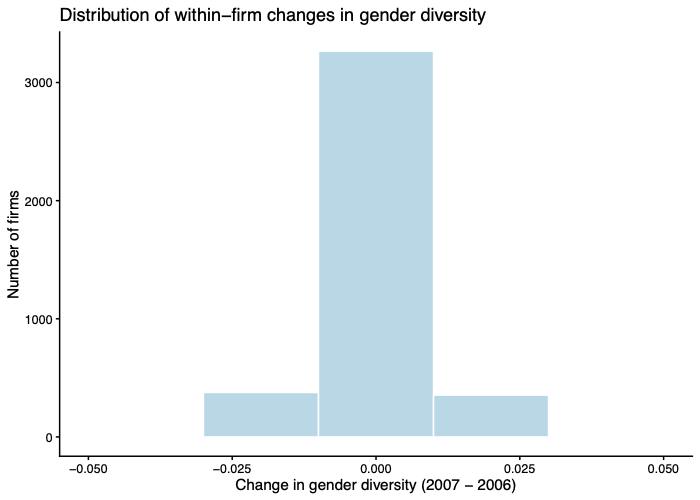
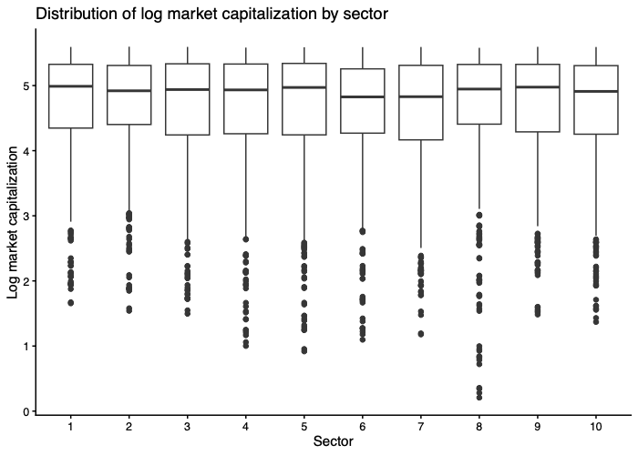

# Corporate Governance Panel Data Analysis


An empirical panel data analysis investigating the relationship between **board gender diversity**, **workforce skills** and **firm financial performance** using corporate governance data and econometric techniques in **R**.

---

# Project Overview

Corporate governance has become a central topic in corporate finance, with increasing attention devoted to board diversity and its potential impact on firm performance.

This project investigates whether greater female representation on corporate boards and workforce skill composition are associated with changes in firm value and short-term debt.

Using panel data econometrics, the analysis compares several estimation techniques to identify robust relationships while accounting for unobserved firm heterogeneity.

The project was developed as part of the **Econometrics** course at the **University of Milan-Bicocca**.

---

# Research Questions

- Does board gender diversity influence firm market capitalization?
- Does workforce skill composition affect firm value?
- Are the estimated relationships robust after controlling for firm-specific heterogeneity?

---

# Dataset

- 4,000 firms
- 8,000 firm-year observations
- Two-year balanced panel
- Pre-2008 financial crisis period
- Firm-level corporate governance and financial indicators

---

# Methodology

The empirical analysis follows a standard panel data workflow.

```text
Data Cleaning
      │
      ▼
Exploratory Data Analysis
      │
      ▼
Pooled OLS
      │
      ▼
Fixed Effects Model
      │
      ▼
Random Effects Model
      │
      ▼
Hausman Test
      │
      ▼
Robustness Checks
      │
      ▼
Economic Interpretation
```

---

# Econometric Models

The project compares several econometric specifications:

- Pooled Ordinary Least Squares (OLS)
- Fixed Effects (Within Estimator)
- Two-Way Fixed Effects
- Random Effects
- Hausman Specification Test
- Robust Standard Errors
- Interaction Models

---

# Technologies

| Category | Tools |
|----------|-------|
| Programming | R |
| Econometrics | plm |
| Statistical Testing | lmtest |
| Robust Inference | sandwich |
| Tables | stargazer |
| Data Manipulation | dplyr, tidyr |
| Visualization | ggplot2 |

---

# Results

## Market Capitalization Distribution


---

## Gender Diversity Distribution


---

## Within-Firm Variation



---

## Market Capitalization by Sector



---

# Key Findings

- Female board representation shows a positive association with firm market capitalization in pooled regressions.
- Fixed Effects estimates substantially reduce the magnitude and statistical significance of this relationship.
- The limited within-firm variation in board composition makes causal identification particularly challenging.
- Hausman tests support the comparison between Fixed and Random Effects specifications.
- The project highlights the importance of choosing appropriate panel estimators when analysing corporate governance data.

---

# Skills Demonstrated

- Panel Data Econometrics
- Corporate Finance
- Corporate Governance
- Fixed Effects Models
- Random Effects Models
- Hausman Test
- Robust Standard Errors
- Data Visualization
- Statistical Inference
- R Programming
- Regression Analysis

---

# Repository Structure

```text
corporate-governance-panel-analysis/
│
├── README.md
├── R/
│   └── analysis.R
├── figures/
│   ├── market_cap_distribution.png
│   ├── gender_diversity_distribution.png
│   ├── within_firm_changes.png
│   └── market_cap_by_sector.png
└── report/
    └── Corporate_Governance_Panel_Analysis.pdf
```

---

# Project Report

The complete report describing the dataset, econometric methodology and empirical findings is available here:

📄 **[Corporate Governance Panel Analysis](report/Corporate_Governance_Panel_Analysis.pdf)**

---

# What I Learned

Through this project I gained practical experience in:

- Building panel data models in R.
- Comparing OLS, Fixed Effects and Random Effects estimators.
- Applying Hausman specification tests.
- Interpreting econometric results in a corporate finance context.
- Understanding the importance of within-group variation for causal inference.
- Producing reproducible empirical research using R.

---
## Business Relevance
Understanding whether board diversity contributes to firm performance is relevant for investors, regulators and corporate decision-makers. This analysis illustrates how panel data econometrics can be applied to evaluate governance policies while accounting for firm-specific heterogeneity.
-----
# Authors

- **Daniela Budu**

Université Paris 1 Panthéon-Sorbonne